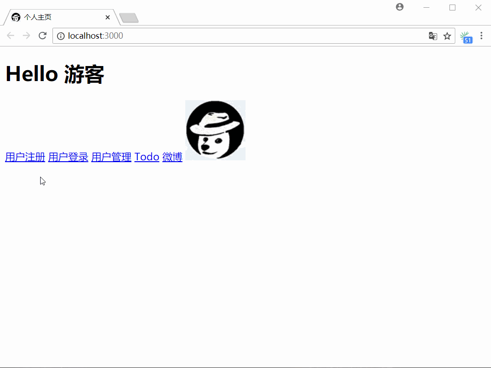

# zenyang-web
基于 Socket 和 HTTP 的 Web MVC 框架。

# 效果图

# 实现的主要功能

1. 用户的注册与登录
2. todo 的增删改查并与用户关联
3. 使用 AJAX 技术的微博
4. 权限验证

# 项目结构
| 文件/目录   |   说明   |    分层    |
| ---------- | -------- | --------- |
| server.py  | 程序入口 | -          |
| models/    | 数据模型 | Model      |
| routes/    | 转发路由 | Controller |
| templates/ | 前端模板 | View       |
| static/    | 静态资源 | -          |
| request.py | 请求分析 | -          |
